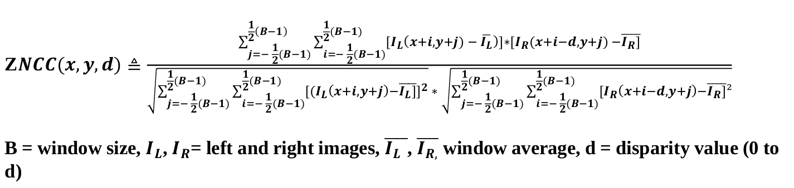
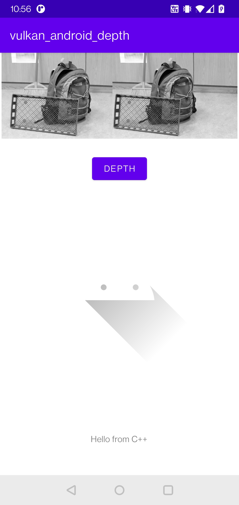
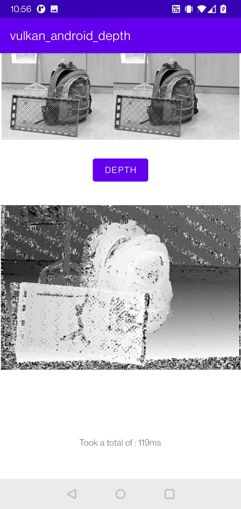

# Vulkan Android depth from stereo image
An example of using Vulkan for image processing on Android. An example for blur (check blur branch) and and depth calculation using Vulkan compute shaders.

Tags: Vulkan, Android, Image processing, GPGPU, Mobile

The depth image is calculated using a disparity map using epipolar geometry with the ZNCC (Zero-Normalized Cross Correlation).

Two images are given as an input that are taken from slightly different positions. The difference between images can be used to approximate depth as objects further away will have less movement and objects closer.

The current implementation was slightly optimized with caching some values from around 150ms down to around 110ms. Much more optimization can be done, especially by using hierarchical memory (note: only support by Adreno GPUs).

  
  
 

